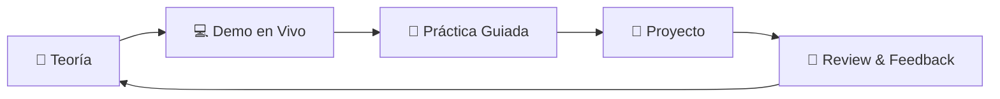

<div align="center">

# 🚀 Desarrollo Fullstack con Next.js

### **El Stack Completo del Desarrollo Web Moderno**


**Un curso intensivo de 4 semanas para dominar el desarrollo fullstack moderno**

[🎯 Objetivos](#-objetivos) • [📚 Contenido](#-contenido-del-curso) • [🛠️ Stack](#️-stack-tecnológico) • [🚀 Requisitos](#-requisitos-previos)

</div>

---

## 📋 Descripción

Este curso va más allá de la sintaxis básica, enfocándose en **conceptos fundamentales**, **patrones de diseño** y **arquitectura de aplicaciones** del mundo real. Aprenderás a construir aplicaciones web fullstack escalables y performantes utilizando el ecosistema más demandado de la industria.

### 🎯 Objetivos

Al finalizar este curso serás capaz de:

- ✅ **Frontend**: Dominar React 18+ con Server y Client Components
- ✅ **Estilado**: Construir interfaces profesionales con Tailwind CSS y sistemas de diseño
- ✅ **Backend**: Desarrollar APIs RESTful robustas con Next.js App Router
- ✅ **Base de Datos**: Diseñar y gestionar bases de datos relacionales con Prisma ORM
- ✅ **Autenticación**: Implementar sistemas de autenticación seguros con NextAuth.js
- ✅ **Validación**: Manejar validaciones con Zod en frontend y backend
- ✅ **Estado**: Gestionar estado global eficientemente con Zustand
- ✅ **Despliegue**: Deploy automático en producción con CI/CD
- ✅ **Colaboración**: Trabajar en equipo con Git, GitHub y metodologías ágiles

---

## 📚 Contenido del Curso

### 📘 Semana 1: Setup, Arquitectura y Fundamentos de Backend

Fundamentos del desarrollo fullstack, configuración del entorno y primeros pasos con APIs.

<details open>
<summary><b>Ver Días 1-5</b></summary>

#### 📌 Día 1: Herramientas y Flujo de Trabajo
- Arquitectura Fullstack (Cliente-Servidor)
- Setup de VSCode, Node.js y npm
- Flujo de Git/GitHub para trabajo colaborativo
- Ramas, Pull Requests y resolución de Merge Conflicts
- Presentación del Proyecto Final

#### 📌 Día 2: Entorno Next.js y Deploy
- Inicialización del template base (Next.js App Router)
- Configuración de variables de entorno (`.env`)
- Deploy automático inicial en Vercel
- Integración Continua (CI) desde el día 1

#### 📌 Día 3: Bases de Datos y Diseño
- Bases de datos Relacionales vs No Relacionales
- Diseño de base de datos del proyecto
- Diagrama Entidad-Relación (ERD)
- Normalización y buenas prácticas

#### 📌 Día 4: Backend I - APIs RESTful
- ¿Qué es una API REST?
- Métodos HTTP (GET, POST, PUT, DELETE)
- Status Codes y mejores prácticas
- Testing de endpoints con Postman/Thunder Client

#### 📌 Día 5: Backend II - ORMs y Conexión
- ¿Qué es un ORM y por qué usarlo?
- Configuración de Prisma ORM
- Conexión a base de datos en la nube (Supabase/Neon)
- Primeras queries con Prisma Client

</details>

---

### 📗 Semana 2: Core Backend, Base de Datos y Autenticación

Desarrollo completo del backend con autenticación, seguridad y validaciones.

<details open>
<summary><b>Ver Días 6-10</b></summary>

#### 📌 Día 6: Backend III - Modelado de Datos
- Creación del `schema.prisma`
- Generación de migraciones
- Seeding: sembrado de datos de prueba
- Relaciones entre modelos

#### 📌 Día 7: Backend IV - Lógica de Negocio
- Creación de Route Handlers en Next.js
- Endpoints GET y POST
- Separación de responsabilidades (Controladores vs Servicios)
- Arquitectura limpia

#### 📌 Día 8: Backend V - CRUD Completo
- Endpoints PUT y DELETE
- Relaciones entre tablas
- Operaciones complejas con Prisma
- Manejo de transacciones

#### 📌 Día 9: Backend VI - Seguridad y Autenticación
- Conceptos de JWT, Cookies y Sesiones
- Integración de NextAuth.js (Auth.js)
- Proveedores OAuth (Google, GitHub)
- Autenticación con credenciales

#### 📌 Día 10: Backend VII - Validaciones y Middleware
- Validación de datos con Zod
- Middleware de autenticación
- Manejo global de errores
- Review del código Backend

</details>

---

### 📙 Semana 3: Frontend y Consumo de APIs

Construcción de interfaces modernas y conexión con el backend.

<details open>
<summary><b>Ver Días 11-15</b></summary>

#### 📌 Día 11: Frontend I - Arquitectura UI
- Server Components vs Client Components
- App Router y File-based Routing
- Layouts compartidos y anidados
- Navegación y Link components

#### 📌 Día 12: Frontend II - Sistema de Diseño
- Maquetado profesional con Tailwind CSS
- Componentes UI reutilizables (shadcn/ui)
- Temas y modo oscuro
- Responsive design

#### 📌 Día 13: Frontend III - Estado y Formularios
- Gestión de estado global con Zustand
- React Hook Form para formularios eficientes
- Validación en cliente con Zod
- Manejo de errores de formularios

#### 📌 Día 14: Frontend IV - Integración (Lectura)
- Consumo de APIs con Fetch/React Query
- Estados de carga (Loaders, Skeletons)
- Manejo de errores
- Caché y revalidación

#### 📌 Día 15: Frontend V - Integración (Mutaciones)
- Envío de datos al servidor
- Optimistic Updates
- Rutas protegidas
- Redirecciones y middleware

</details>

---

### 📕 Semana 4: Integración Fullstack, Revisiones y Cierre

Testing, optimización y preparación para producción.

<details open>
<summary><b>Ver Días 16-20</b></summary>

#### 📌 Día 16: Fullstack I - Testing y UX
- Testing manual end-to-end
- Optimistic UI para mejor UX
- Sincronización Frontend/Backend
- Feedback al usuario

#### 📌 Día 17: Fullstack II - Refactorización
- Identificación de Code Smells
- Refactorización de componentes grandes
- Eliminación de código duplicado
- Mejores prácticas y patrones

#### 📌 Día 18: Revisiones I - QA Colaborativo
- Quality Assurance cruzado entre equipos
- Reporte de bugs usando GitHub Issues
- Testing de features de otros equipos
- Documentación de problemas

#### 📌 Día 19: Revisiones II - Optimización
- Resolución de Issues reportados
- Auditoría con Lighthouse
- Optimización de performance
- Configuración final de producción

#### 📌 Día 20: Presentación Final 🎉
- Demo del proyecto en producción
- Presentación de features implementadas
- Retrospectiva del curso
- Siguientes pasos y recursos

</details>
---

## 🛠️ Stack Tecnológico

### Frontend
| Tecnología   | Versión | Descripción                         |
| ------------ | ------- | ----------------------------------- |
| ⚛️ **React**        | 18+     | Librería para interfaces de usuario con Server Components |
| ▲ **Next.js**      | 14+     | Framework React fullstack con App Router           |
| 🎨 **Tailwind CSS** | 3+      | Framework CSS utility-first         |
| 🎭 **shadcn/ui**    | Latest  | Componentes UI reutilizables y accesibles |
| 🐻 **Zustand**      | 4+      | Gestión de estado global minimalista |
| 📋 **React Hook Form** | 7+   | Manejo eficiente de formularios |

### Backend
| Tecnología   | Versión | Descripción                         |
| ------------ | ------- | ----------------------------------- |
| 🟢 **Node.js**      | 18+     | Runtime de JavaScript              |
| ▲ **Next.js API**  | 14+     | Route Handlers para APIs RESTful   |
| 🔷 **Prisma ORM**   | Latest  | ORM moderno para bases de datos    |
| 🐘 **PostgreSQL**   | Latest  | Base de datos relacional           |
| 🔐 **NextAuth.js**  | 5+      | Autenticación completa            |
| ✅ **Zod**          | 3+      | Validación de schemas TypeScript   |

### DevOps & Tools
| Tecnología   | Versión | Descripción                         |
| ------------ | ------- | ----------------------------------- |
| 🔷 **TypeScript**   | 5+      | JavaScript tipado                  |
| 📦 **npm/pnpm**     | Latest  | Gestión de paquetes               |
| 🔧 **Git**          | Latest  | Control de versiones              |
| 🐙 **GitHub**       | -       | Repositorio y colaboración        |
| ▲ **Vercel**        | -       | Plataforma de deployment          |
| 🔨 **Postman**      | Latest  | Testing de APIs                   |

---

## 📂 Estructura del Repositorio

```
📦 FullstackConNextJS
├── 📁 Semana1/          # Setup, Arquitectura y Fundamentos Backend
├── 📁 Semana2/          # Core Backend, Base de Datos y Autenticación
├── 📁 Semana3/          # Frontend y Consumo de APIs
├── 📁 semana4/          # Integración Fullstack y Revisiones
├── 📁 Recursos/         # Recursos adicionales, cheat sheets y ejemplos
├── 📁 Images/           # Imágenes, diagramas y assets del curso
├── 📄 .gitignore        # Archivos ignorados por Git
└── 📄 README.md         # Documentación principal
```

---

## 🚀 Requisitos Previos

### Conocimientos
- ✅ Fundamentos de HTML, CSS y JavaScript
- ✅ Conceptos básicos de programación (variables, funciones, condicionales)
- ✅ Familiaridad con la terminal/línea de comandos

### Software Necesario
| Herramienta | Versión Mínima | Link |
| ----------- | -------------- | ---- |
| **Node.js** | 18+ | [Descargar](https://nodejs.org/) |
| **Git** | 2.0+ | [Descargar](https://git-scm.com/) |
| **VS Code** | Latest | [Descargar](https://code.visualstudio.com/) |

### Cuentas Requeridas
- 🐙 Cuenta en **GitHub** (para repositorio y colaboración)
- ▲ Cuenta en **Vercel** (para deployment automático)
- 🗄️ Cuenta en **Supabase** o **Neon** (base de datos gratuita)

### Extensiones Recomendadas para VS Code
```
- ES7+ React/Redux/React-Native snippets
- Tailwind CSS IntelliSense
- Prisma
- ESLint
- Prettier
- GitLens
- Thunder Client (para testing de APIs)
```

---

## 💡 Metodología de Aprendizaje

Este curso sigue un enfoque **práctico y basado en proyectos**:



### Principios del Curso

1. **🎯 Conceptos sobre Sintaxis**: Entender el "por qué" antes del "cómo"
2. **🔨 Learning by Doing**: Código desde el día 1
3. **🏗️ Proyectos Reales**: Aplicaciones del mundo real, no ejemplos triviales
4. **👥 Trabajo Colaborativo**: Git workflow profesional y code reviews
5. **✨ Best Practices**: Patrones de la industria desde el principio

---

## 🎯 Proyecto Final

Durante el curso desarrollarás una **aplicación fullstack completa** que incluirá:

- ✅ Frontend moderno con React y Tailwind CSS
- ✅ Backend RESTful API con Next.js
- ✅ Base de datos relacional con Prisma
- ✅ Sistema de autenticación y autorización
- ✅ CRUD completo con relaciones
- ✅ Validaciones en cliente y servidor
- ✅ Deploy automático en producción
- ✅ Trabajo en equipo con Git/GitHub

**Ejemplos de proyectos**: Sistema de gestión de tareas, Blog con autores, E-commerce básico, Red social simple.

---

## 📖 Recursos Adicionales

### Documentación Oficial
- 📘 [React Documentation](https://react.dev) - La nueva documentación oficial de React
- 📗 [Next.js Documentation](https://nextjs.org/docs) - Guías completas de Next.js 14+
- 📙 [Tailwind CSS Docs](https://tailwindcss.com/docs) - Referencia de utilidades
- 📕 [Prisma Docs](https://www.prisma.io/docs) - Guía completa de Prisma ORM
- 🔐 [NextAuth.js Guide](https://next-auth.js.org/) - Autenticación en Next.js
- ✅ [Zod Documentation](https://zod.dev/) - Validación de schemas

### Herramientas y Recursos
- 🎨 [shadcn/ui](https://ui.shadcn.com/) - Componentes UI para copiar y pegar
- 🎭 [Tailwind UI](https://tailwindui.com/) - Componentes premium de Tailwind
- 🐻 [Zustand](https://github.com/pmndrs/zustand) - State management simple
- 📋 [React Hook Form](https://react-hook-form.com/) - Formularios performantes
- 🗄️ [Supabase](https://supabase.com/) - Backend as a Service
- 🐘 [Neon](https://neon.tech/) - Postgres serverless

### Lecturas Recomendadas
- 📚 [MDN Web Docs](https://developer.mozilla.org) - Referencia web completa
- 📚 [Patterns.dev](https://www.patterns.dev/) - Patrones de diseño modernos
- 📚 [JavaScript.info](https://javascript.info/) - Tutorial moderno de JS
- 📚 [web.dev](https://web.dev/) - Mejores prácticas por Google

---

## 🤝 Contribuir

¿Encontraste un error o tienes una sugerencia? ¡Las contribuciones son bienvenidas!

### Cómo Contribuir

1. 🍴 Haz fork del repositorio
2. 🌿 Crea una rama con tu feature
   ```bash
   git checkout -b feature/mi-mejora
   ```
3. ✍️ Commit tus cambios
   ```bash
   git commit -m 'Añade: descripción de la mejora'
   ```
4. 📤 Push a la rama
   ```bash
   git push origin feature/mi-mejora
   ```
5. 🔀 Abre un Pull Request

### Tipos de Contribuciones

- 🐛 Corrección de errores en el código o documentación
- 📝 Mejoras en la documentación
- ✨ Nuevos ejemplos o ejercicios
- 💡 Sugerencias de contenido adicional

---

## 📊 Roadmap del Curso

```
Semana 1 ████████████░░░░░░░░ 25% - Backend Foundations
Semana 2 ░░░░░░░░░░░░████████░░ 50% - Backend Advanced
Semana 3 ░░░░░░░░░░░░░░░░░░████ 75% - Frontend & Integration
Semana 4 ░░░░░░░░░░░░░░░░░░░░██ 100% - Polish & Deploy
```

---

## ❓ FAQ

<details>
<summary><b>¿Necesito saber TypeScript?</b></summary>

No es estrictamente necesario, pero es recomendable. TypeScript será introducido gradualmente durante el curso.

</details>

<details>
<summary><b>¿El curso es gratuito?</b></summary>

Este repositorio contiene material educativo abierto. Consulta con el instructor sobre modalidades del curso.

</details>

<details>
<summary><b>¿Puedo usar este material para enseñar?</b></summary>

Sí, el material está bajo licencia MIT. Puedes usarlo, modificarlo y compartirlo libremente dando crédito.

</details>

<details>
<summary><b>¿Qué pasa si me retraso?</b></summary>

El repositorio estará disponible permanentemente. Puedes seguir el curso a tu propio ritmo.

</details>

---

## 📧 Contacto y Soporte

¿Tienes preguntas o necesitas ayuda?

- 💬 Abre un [Issue](../../issues) en este repositorio
- 🐛 Reporta bugs usando la [plantilla de issues](../../issues/new)
- 💡 Sugiere mejoras o nuevo contenido
- ⭐ Dale una estrella al repo si te resultó útil

---

<div align="center">

### **¡Feliz Aprendizaje! 🚀**

**De cero a fullstack developer en 4 semanas**


*Hecho con ❤️ para la comunidad de desarrolladores*

[](../../)
[](https://vercel.com)

</div>
